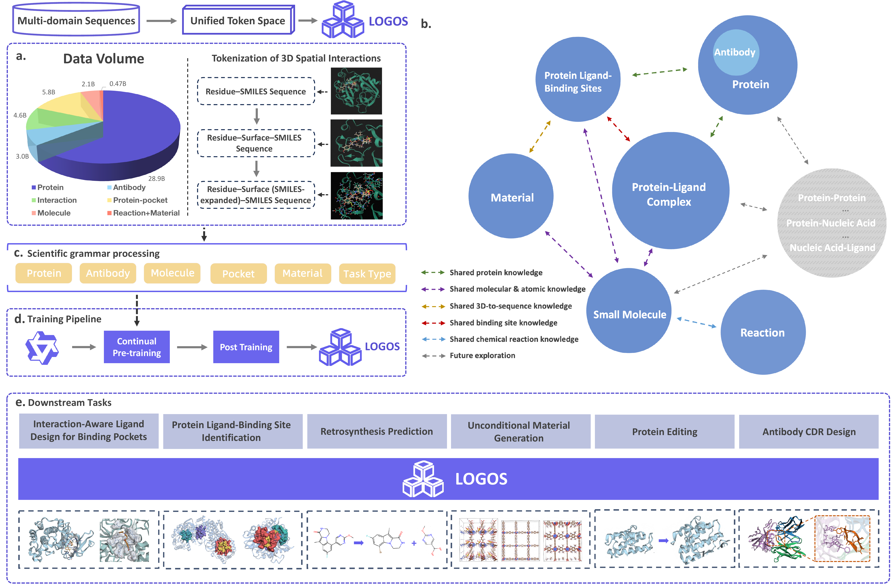
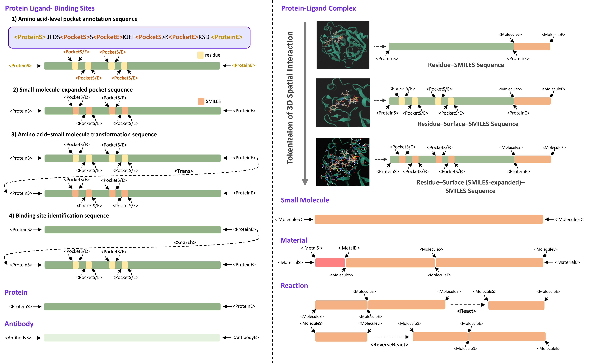
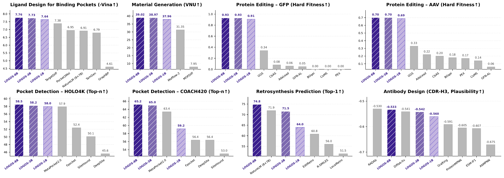

# LOGOS: Language of Generative Objects in Science

<p align="center">
  
</p>

<p align="center">
<a href="https://arxiv.org/pdf/2606.16905" target="_blank"></a>&nbsp;
<a href="https://github.com/LOGOS-Hub/LOGOS"></a>&nbsp;
<a href="README_zh.md">中文</a>
</p>

<p align="center">
<a href="https://huggingface.co/LOGOS-Hub/LOGOS-8B"></a>&nbsp;
<a href="https://huggingface.co/LOGOS-Hub/LOGOS-pretrain-1B"></a>&nbsp;
<a href="https://huggingface.co/LOGOS-Hub/LOGOS-pretrain-3B"></a>&nbsp;
<a href="https://huggingface.co/LOGOS-Hub/LOGOS-pretrain-8B"></a>
</p>

## Overview

**LOGOS** (**L**anguage **O**f **G**enerative **O**bjects in **S**cience) is the first multi-domain generative framework built on a unified *scientific grammar*. It encodes diverse scientific objects — proteins, antibodies, small molecules, chemical reactions, materials, and their spatial interactions — as token sequences over a shared vocabulary, enabling a single autoregressive model to perform generation, prediction, and design across the natural sciences.

Unlike approaches that rely on natural language as an intermediary or require explicit 3D geometric networks, LOGOS operates directly on domain-native representations. Key spatial relationships (e.g., protein pocket–ligand contacts) are discretized and tokenized into the shared grammar, allowing the model to learn complex structural interactions in a purely sequential manner.

<p align="center">
  
</p>

### Key Features

* **Unified Scientific Grammar**: A shared representational interface that encodes heterogeneous scientific objects and cross-object relationships into a common discrete token space.
* **One Model Fits All**: A single autoregressive model handles tasks across proteins, small molecules, materials, reactions, antibodies, and their interactions.
* **No Explicit 3D Geometry Required**: Spatial contact and constraint patterns are captured through tokenized representations, without relying on geometric neural networks or explicit coordinates.
* **Pre-training & Downstream Alignment**: The grammar space ensures formal consistency between continued pre-training objectives and downstream task goals.

<p align="center">
  
</p>

## Repository Contents

This repository provides **inference scripts** for four representative downstream tasks of LOGOS:

| Task | Domain | Script | Description |
| ---- | ------ | ------ | ----------- |
| Retrosynthesis Prediction | Chemistry | `reversereact_gen.py` | Predict reactants given a target product |
| Protein Ligand-Binding Site Identification | Structural Biology | `pocket_gen.py` | Identify binding pockets from protein sequences |
| Interaction-Aware Ligand Design for Binding Pockets | Drug Discovery | `protein_ligand_interaction.py` | Generate ligands capable of specifically binding to a protein binding pocket |
| Unconditional Material Generation | Materials Science | `material_generation.py` | Generate novel and valid materials |

<p align="center">
  
</p>

## Environment Setup

We recommend using the official NVIDIA PyTorch Docker image as the base environment.

### 1. Pull the NVIDIA PyTorch Docker image

```bash
docker pull nvcr.io/nvidia/pytorch:25.02-py3
```

### 2. Launch the container

```bash
docker run --gpus all -it --rm \
    -v $(pwd):/workspace \
    -w /workspace \
    nvcr.io/nvidia/pytorch:25.02-py3 bash
```

**Requirements:**
- NVIDIA Docker image: `nvcr.io/nvidia/pytorch:25.02-py3`
- CUDA-compatible GPU
- LOGOS model checkpoint (download from Hugging Face)

## Quick Start

```python
from transformers import AutoModelForCausalLM, AutoTokenizer

model = AutoModelForCausalLM.from_pretrained("placeholder/LOGOS-8B")
tokenizer = AutoTokenizer.from_pretrained("placeholder/LOGOS-8B")

input_text = "<your_scientific_grammar_input>"
inputs = tokenizer(input_text, return_tensors="pt")
outputs = model.generate(**inputs, max_new_tokens=512)
print(tokenizer.decode(outputs[0], skip_special_tokens=True))
```

## Task-Specific Inference

### 1. Retrosynthesis Prediction

Generate reactant SMILES given product molecules.

```bash
python reversereact_gen.py \
    --data_file data/reversereact.jsonl \
    --model_path /path/to/checkpoint \
    --results_dir ./results \
    --num_samples 32 \
    --temperature 1.2 \
    --top_p 0.85 \
    --repetition_penalty 1.05 \
    --model_type llama
```

**Input JSONL format:**
```json
{"test_input": "<MoleculeS>COCC)OC.....)cn1<MoleculeE><ReverseReact>", "groundtruth": "<MoleculeS>...<MoleculeE>"}
```

### 2. Protein Ligand-Binding Site Identification

Generate protein pocket sequences conditioned on input prompts.

```bash
python pocket_gen.py \
    --data_file data/pocket_trans.jsonl \
    --model_path /path/to/checkpoint \
    --results_dir ./results \
    --num_samples 40 \
    --batch_size 16 \
    --temperature 1.2 \
    --top_p 0.85 \
    --repetition_penalty 1.05 \
    --model_type llama
```

**Input JSONL format:**
```json
{"id": "sample_001.pdb", "text": "<ProteinS>...<ProteinE><Search>"}
```

### 3. Interaction-Aware Ligand Design

Generate interaction-aware ligand sequences from protein pocket prompts.

```bash
python protein_ligand_interaction.py \
    --data_file data/protein_ligand.jsonl \
    --model_path /path/to/checkpoint \
    --results_dir ./results \
    --num_samples 10 \
    --batch_size 16 \
    --temperature 1.2 \
    --top_p 0.85 \
    --repetition_penalty 1.05 \
    --model_type llama
```

**Input JSONL format:**
```json
{"id": "sample_001.pdb", "protein_pocket_ligand": "<ProteinS>...", "groundtruth": "..."}
```

### 4. Unconditional Material Generation

Generate material structures from the `<MaterialS>` prompt. No input data file is required.

```bash
python material_generation.py \
    --model_path /path/to/checkpoint \
    --results_dir ./results \
    --num_samples 10000 \
    --batch_size 32 \
    --temperature 1.2 \
    --top_p 0.85 \
    --model_type llama
```

## Common Arguments

| Argument | Type | Default | Description |
|----------|------|---------|-------------|
| `--model_path` | str | (required) | Path to model checkpoint |
| `--results_dir` | str | `./results` | Output directory |
| `--top_p` | float | varies | Nucleus sampling top-p |
| `--temperature` | float | varies | Sampling temperature |
| `--repetition_penalty` | float | 1.05 | Repetition penalty |
| `--num_samples` | int | varies | Generations per input |
| `--batch_size` | int | 16 | Batch size |
| `--model_type` | str | `llama` | Model type: `llama` or `qwen` (use `llama` for 1B / 3B models, `qwen` for 8B model) |

## Output Format

Results are saved as JSONL files under `results_dir/<task>_<t>_<p>_<rp>/results.jsonl`.

**Example output (retrosynthesis):**
```json
{"sequence": "...", "ppl": 12.34, "groundtruth": "..."}
```

**Example output (material generation):**
```json
{"text": "<MaterialS>...<MaterialE>", "ppl": 8.56}
```

## Model Architecture

LOGOS is based on an autoregressive Transformer architecture with continued multi-domain pre-training on a unified scientific grammar. The framework spans a parameter range from **1B to 8B**, with stable scaling behavior observed across this range.

## Citation

LOGOS is developed by Alibaba Group and Gaoling School of Artificial Intelligence, Renmin University of China. If you find this work useful in your research or applications, please cite our technical report.

```bibtex
@misc{li2026speakinglanguagesciencegeneralpurpose,
      title={Speaking the Language of Science: Toward a General-Purpose Generative Foundation Model for the Natural Sciences}, 
      author={Mingyang Li and Yurou Liu and Jieping Ye and Bing Su and Ji-Rong Wen and Zheng Wang},
      year={2026},
      eprint={2606.16905},
      archivePrefix={arXiv},
      primaryClass={cs.CL},
      url={https://arxiv.org/abs/2606.16905}, 
}
```

## Contact

If you have any questions, feel free to reach us at:

Yurou Liu: yurouliu99@gmail.com

Mingyang Li: sangheng.lmy@alibaba-inc.com


## License

This project is released under the **[Apache License 2.0](https://www.apache.org/licenses/LICENSE-2.0)**.

We welcome collaboration, feedback, and community contributions to advance unified generative modeling for the natural sciences.
